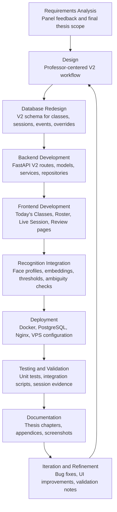

# Appendix M: Project Timeline and Development Activity

This appendix summarizes the development activity for the Facial Recognition Attendance System Version 2 (FRAS V2). The original FRAS V1 implementation is included only as an early background milestone. The final thesis scope is FRAS V2, which revised the original attendance-checking approach into a professor-centered classroom presence monitoring workflow.

Evidence sources used for this appendix include local Git history, V2 source folders, database scripts, deployment files, tests, and thesis appendix files in the repository. No private emails, tokens, credentials, or secret values are included.

## M.1 Development Milestones

| Milestone | Description | Output / Evidence |
|---|---|---|
| Original FRAS V1 implementation | The early system implemented facial-recognition-based attendance monitoring, registration, schedules, room/class data, attendance logs, authentication, and administrative functions. This is treated as background only and not as the final V2 scope. | Early commits from August 2025 to May 2026; files under `api/`, `services/`, `repositories/`, `facial-attendance/src/app/`, and V1 documentation. |
| Panel feedback and revision planning | The repository history shows panel feedback fixes, attendance report updates, user/support UI changes, deployment repair, and documentation polish before the V2 redesign. | Commit messages such as `feedback 1-5 changes`, `feedback changes for attendance reports/generate reports page`, `fix: apply support and user management panel feedback`, and project documentation files. |
| FRAS V2 redesign | The system was revised into a professor-centered workflow focused on Today's Classes, Class Roster, Face Profile, Live Session, Review, Student Evidence, Finalization, History, and CSV export. | Commit on 2026-06-06: `V2 -Database -Backend -Frontend Landing and Monitor`; folders `v2/` and `facial-attendance/src/app/v2/`. |
| V2 database redesign | A dedicated V2 schema was created for professors, students, courses, rooms, classes, enrollments, face profiles, sessions, student records, events, overrides, and Blackboard/export tracking. | `database/v2_schema.sql`, `database/init_v2_database.py`, `database/seed_v2_from_v1.py`, `database/verify_v2_integration_seed.py`. |
| V2 backend development | FastAPI V2 routes, models, service logic, and repository SQL were implemented under the dedicated V2 backend module. | `v2/api.py`, `v2/models.py`, `v2/service.py`, `v2/repository.py`. |
| V2 frontend development | Angular V2 pages and shared components were implemented for professor workflow screens. | `facial-attendance/src/app/v2/pages/`, `facial-attendance/src/app/v2/components/`, `facial-attendance/src/app/v2/models/v2-attendance.models.ts`. |
| Facial recognition and embedding integration | Face profile registration, embedding storage, class-scoped recognition, threshold handling, and ambiguity checks were integrated into V2. | `services/face_embeddings.py`, `v2/service.py`, `tests/test_v2_recognition_decision.py`; commit on 2026-06-12: `recognition threshold improvement...`. |
| Session break and return detection implementation | Session break and return detection were implemented through break endpoints, recognition capture, and attendance event recording. | `POST /api/v2/sessions/{session_id}/break/start`, `POST /api/v2/sessions/{session_id}/break/end`, `POST /api/v2/classes/{class_id}/recognize`, `POST /api/v2/sessions/{session_id}/events`; `live-session.component.ts`. |
| Post-session review and finalization implementation | Review summaries, professor confirmation, overrides, Mark Excused, finalization, and CSV export readiness were implemented. | `post-session-review.component.ts`, `student-evidence.component.ts`, `v2/api.py`, `v2/service.py`, `v2/repository.py`. |
| Deployment and integration | Docker containerization and VPS deployment files were added for backend, frontend, PostgreSQL, and deployment verification. | Commit on 2026-06-10: `docker containerization and vps deployment, finalized v2 code`; `docker-compose.v2.yml`, `Dockerfile.backend.v2`, `deployment/`, `facial-attendance/Dockerfile.v2`. |
| Testing and validation | V2 test files and verification scripts were added. Safe recognition decision unit tests were executed during appendix preparation. | `tests/test_v2_recognition_decision.py`, `tests/test_v2_api.py`, `tests/test_v2_session_end_boundaries.py`, `database/verify_v2_full_integration.py`; result: `5 passed in 13.32s` for recognition decision tests. |
| Thesis documentation and appendix preparation | Thesis evidence files, system documentation, sample session evidence, testing reports, ERD/API appendices, and deployment appendix materials were prepared. | `FRAS_V2_*` Markdown files, `docs/APPENDIX_*`, `FRAS_V2_APPENDIX_D_API_DOCUMENTATION.md`, `FRAS_V2_APPENDICES_EVIDENCE.md`, this Appendix M draft. |

## M.2 Project Timeline

The dates below are based on local Git history inspected from the current branch. Where the Git evidence only indicates broad activity, the table uses phases rather than claiming exact completion dates.

| Period / Phase | Activity | Output |
|---|---|---|
| 2025-08-21 | Initial repository creation. | Earliest local commit: `Initial commit`. |
| August to October 2025 | Early FRAS V1 development, including backend/data work, registration, schedule handling, attendance logs, room/class data, and facial recognition experiments. | Early V1 application structure, database scripts, API modules, and Angular/Ionic frontend pages. |
| November to December 2025 | V1 authentication, role-based/admin functionality, user management, system settings, support ticket features, and attendance export features were developed. | Authentication/admin-related commits; early attendance export commit on 2025-12-09. |
| January to February 2026 | Face data, dataset handling, Docker/deployment preparation, environment cleanup, and PostgreSQL/embedding support were improved. | Dataset and deployment commits; `services/face_embeddings.py`; Docker and environment-related commits. |
| April to May 2026 | Panel feedback, deployment repair, demo reset workflow, analytics/report polishing, migration to PostgreSQL, and additional testing/deployment fixes were performed. | Commit messages for feedback changes, demo reset, analytics, report filters, duplicate room fixes, and deployment setup. |
| 2026-06-06 | FRAS V2 redesign started in Git as a dedicated V2 database, backend, frontend landing, and monitor implementation. | Commit: `V2 -Database -Backend -Frontend Landing and Monitor`; folders `v2/`, `database/v2_schema.sql`, `facial-attendance/src/app/v2/`. |
| 2026-06-07 | Professor schedules, professor logins, V2 pages, face registration, and recognition workflow were developed. | Commits: `added professor schedule and logins...`; `added all pages, working face registration and facial recognition.` |
| 2026-06-08 to 2026-06-09 | V2 seed data, final professor dataset preparation, bug fixes, and Session History page were added. | Commits: `v2 changes with seeding data`; `final changes before final professor dataset`; `Bug Fixes 1-6... Added Session History Page`. |
| 2026-06-10 | V2 Docker containerization and VPS deployment work was added and marked as finalized V2 code in the commit message. | Commit: `docker containerization and vps deployment, finalized v2 code`; files `docker-compose.v2.yml`, `Dockerfile.backend.v2`, `deployment/`. |
| 2026-06-12 to 2026-06-15 | Recognition threshold improvements, manual attendance UI fixes, automatic face detection on registration, image quality fixes, and registration fixes were added. | Commits: `recognition threshold improvement...`, `improved image quality`, `added fix for cam qual.`, `registration fix 3`. |
| 2026-06-19 to 2026-06-23 | Thesis documentation, sample session evidence, testing summaries, API documentation, appendix drafts, and final evidence preparation were created. | Markdown evidence files including Chapter 4 evidence, API documentation, ERD material, testing results, and appendix files. |

## M.3 Development Workflow Diagram

## M.4 GitHub Repository Activity

| Item | Repository inspection result |
|---|---|
| Earliest relevant local commit date | 2025-08-21 |
| Earliest local commit message | `Initial commit` |
| Latest local commit date inspected | 2026-06-23 |
| Latest local commit message inspected | `push before appendix` |
| Total commits on current branch | 213 commits |
| Note on GitHub visibility | The latest local commit may not be visible on GitHub until the large archive push issue is resolved. Use GitHub screenshots only after confirming the push succeeded. |
| V2-specific development start visible in Git history | 2026-06-06, commit message `V2 -Database -Backend -Frontend Landing and Monitor` |
| Main shift visible in history | The repository moved from the original V1 attendance-checking/admin-heavy system toward a dedicated V2 professor-centered classroom presence monitoring workflow in June 2026. |

### Main Development Phases Shown by Commit Messages

| Phase | Evidence from commit history |
|---|---|
| Early database/frontend/API foundation | August to October 2025 commits for database migration, room/schedule pages, attendance logs, registration, monitor page, and facial recognition work. |
| Authentication and admin/report features | November to December 2025 commits for JWT/authentication, user management, system settings, support tickets, super admin, and attendance export. |
| Deployment, dataset, and embedding support | February to May 2026 commits for Docker/deployment prep, dataset mounting, PostgreSQL migration, face embedding DDL, and report/panel feedback fixes. |
| FRAS V2 redesign and implementation | June 2026 commits for V2 database, backend, frontend, professor schedules, face registration, recognition, seed data, Session History, Docker containerization, and VPS deployment. |
| V2 validation and appendix documentation | June 2026 files and commits for test cases, Chapter 4 evidence, finalized session evidence, API documentation, ERD support, and appendix preparation. |

### Important V2 Files and Folders Updated

| Area | Files or folders |
|---|---|
| V2 backend API and logic | `v2/api.py`, `v2/models.py`, `v2/service.py`, `v2/repository.py` |
| V2 database | `database/v2_schema.sql`, `database/init_v2_database.py`, `database/seed_v2_from_v1.py`, `database/seed_v2_integration_data.py`, `database/verify_v2_full_integration.py` |
| V2 frontend | `facial-attendance/src/app/v2/pages/`, `facial-attendance/src/app/v2/components/`, `facial-attendance/src/app/v2/models/v2-attendance.models.ts`, `facial-attendance/src/app/api.service.ts` |
| Recognition support | `services/face_embeddings.py`, `v2/service.py`, `tests/test_v2_recognition_decision.py` |
| Deployment | `docker-compose.v2.yml`, `Dockerfile.backend.v2`, `facial-attendance/Dockerfile.v2`, `deployment/` |
| Testing and validation | `tests/test_v2_api.py`, `tests/test_v2_recognition_decision.py`, `tests/test_v2_session_end_boundaries.py`, `database/verify_v2_integration_seed.py`, `database/verify_v2_full_integration.py` |
| Thesis evidence | `FRAS_V2_*` Markdown files and `docs/APPENDIX_*` documentation files |

## M.5 GitHub Contributors or Commit History

Contributor counts below are based on local Git history for the current branch using author names visible in Git. Private emails are intentionally excluded.

| Contributor / visible Git author | Number of commits on current branch | Main contribution area inferred from commit messages |
|---|---:|---|
| Vincent | 154 | Main backend, frontend, database, V2 redesign, deployment, testing, documentation, and thesis evidence activity. |
| chnrixbb | 27 | Early frontend/login/registration design and early facial recognition/UI work. |
| darctae | 11 | Early UI fixes, dataset/face data, and monitor/testing fixes. |
| Shreyansh Jain | 8 | Documentation, demo reset workflow, analytics/report polish, support/user management feedback fixes, deployment repair. |
| Shreyansh Manish Jain | 8 | Same visible activity area as Shreyansh Jain; appears as a separate Git author name in history. |
| SUGz15 | 5 | Merge commits and repository-level integration activity. |

### Screenshot Checklist for Appendix M

| Screenshot | What to capture | Notes |
|---|---|---|
| Repository main page | GitHub repository landing page showing project name and files. | Avoid showing private tokens or account settings. |
| Commit history page | GitHub commits page showing recent activity and dates. | Capture after fixing/pushing the large-file commit issue if you want GitHub to match local history. |
| Contributors page | GitHub contributors graph/list, if available. | Contributor counts may differ from local Git if some commits are not pushed or if GitHub merges identities. |
| Branches page | Branch list, if relevant to development evidence. | Optional if the thesis does not discuss branch strategy. |
| V2 backend folder | Repository view of `v2/`. | Shows final V2 backend module. |
| V2 frontend folder | Repository view of `facial-attendance/src/app/v2/`. | Shows final professor-centered UI structure. |
| Database schema folder | Repository view of `database/`, especially `v2_schema.sql`. | Shows schema and verification scripts. |
| Deployment configuration files | Repository view of `docker-compose.v2.yml`, `Dockerfile.backend.v2`, `deployment/`, and `facial-attendance/Dockerfile.v2`. | Supports deployment appendix evidence. |
| Local Git log proof | Terminal screenshot of `git log --oneline --max-count=20` or GitHub commit list. | Useful if GitHub has not updated yet. |
| Local contributor summary | Terminal screenshot of `git shortlog -sn HEAD`. | Exclude emails. |

## M.6 Appendix M Summary

The Git history shows that FRAS began as an original facial-recognition attendance monitoring system, then underwent feedback-driven fixes, deployment preparation, and reporting/admin improvements. The final thesis system, FRAS V2, appears in the repository history as a distinct June 2026 redesign centered on professors and classroom presence monitoring rather than the earlier V1 attendance-checking approach.

FRAS V2 development introduced a dedicated V2 database schema, FastAPI V2 backend module, Angular V2 frontend pages, class-scoped face profile and embedding support, live session monitoring, session break and return detection behavior, post-session review, student evidence, professor override and Mark Excused actions, attendance finalization, session history, and Blackboard-ready CSV export. Deployment evidence is supported by Docker, PostgreSQL, backend, frontend, and VPS configuration files.

Testing evidence includes V2 unit and integration test files plus verification scripts. The recognition decision unit test was safely executed during appendix preparation and passed. Some integration scripts were inspected but not executed because they can reset, seed, or write database/session data. Therefore, this appendix presents Git and repository evidence as development activity support, not as a claim of formal biometric accuracy, stress testing, or direct Blackboard API synchronization.
