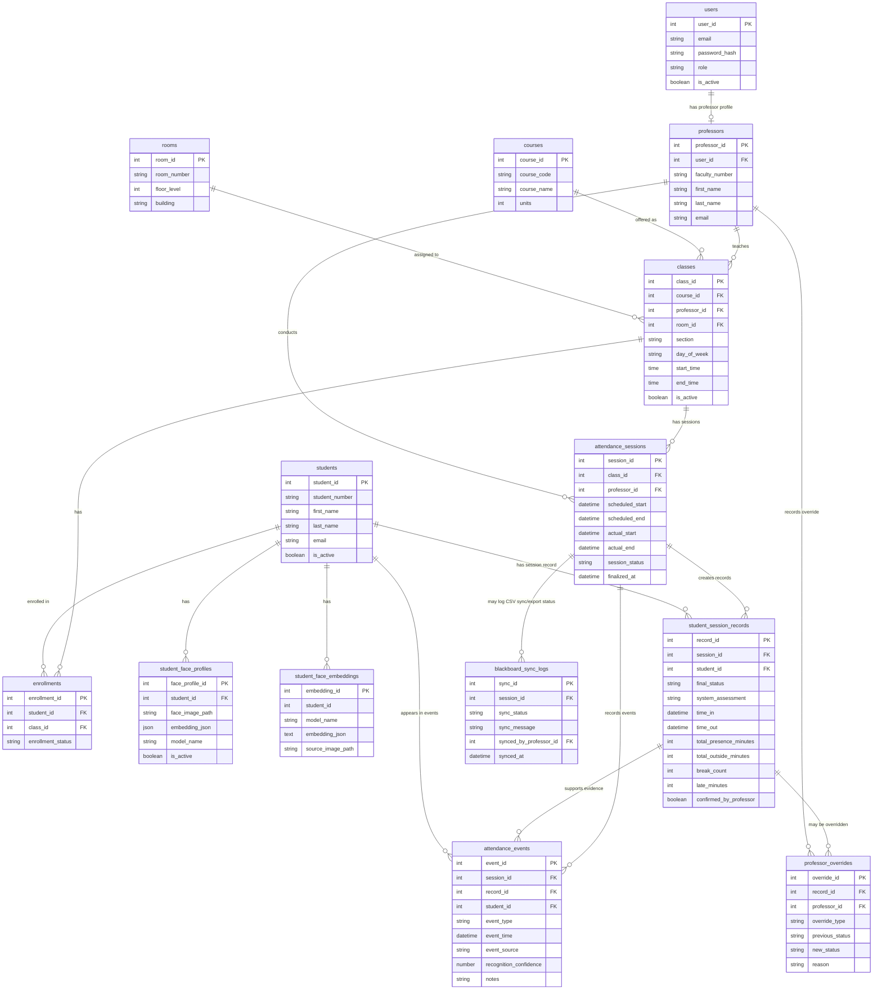
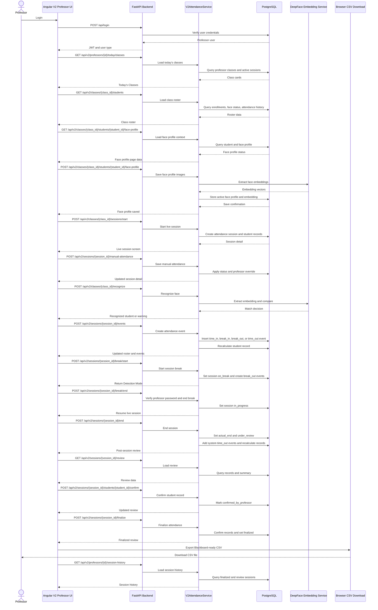
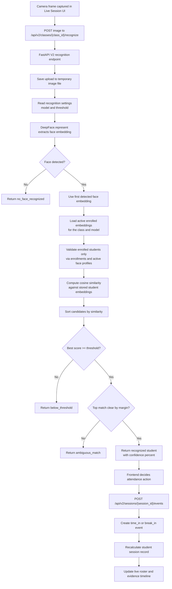
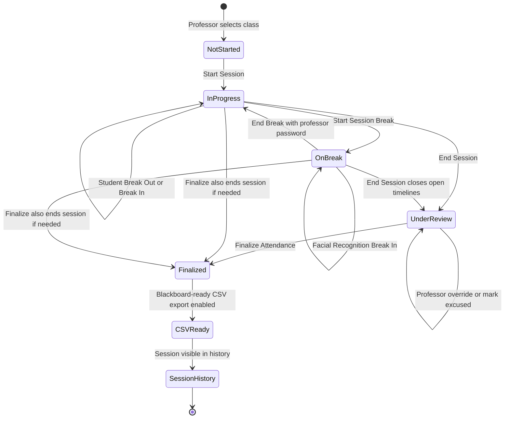
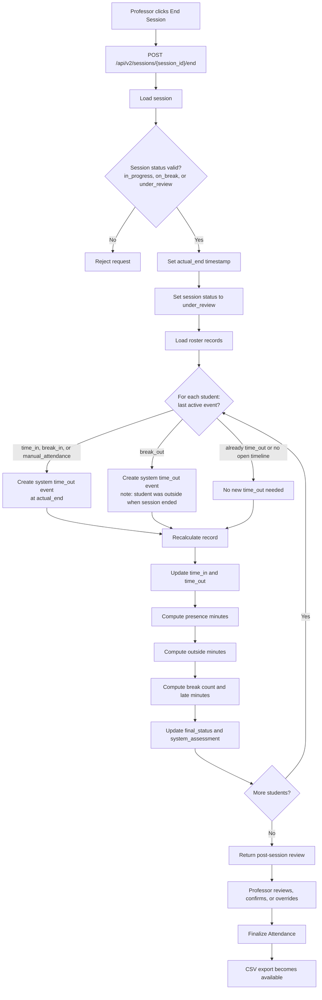
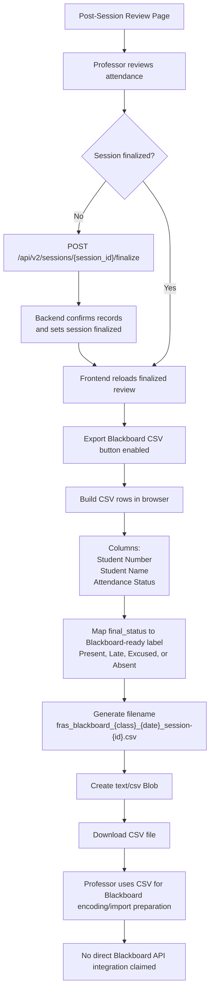

# FRAS V2 Mermaid Diagrams for Thesis

These diagrams are based on the implemented V2 professor-centered workflow in the repository, especially:

- `facial-attendance/src/app/app.routes.ts`
- `facial-attendance/src/app/api.service.ts`
- `v2/api.py`
- `v2/service.py`
- `v2/repository.py`
- `v2/models.py`
- `services/face_embeddings.py`
- `database/v2_schema.sql`
- `docker-compose.v2.yml`
- `Dockerfile.backend.v2`
- `facial-attendance/Dockerfile.v2`
- `facial-attendance/nginx.v2.conf`

## 1. FRAS V2 System Architecture Diagram

Supported by Angular/Ionic frontend routes and API client, FastAPI V2 routes, V2 service/repository layers, DeepFace embedding helpers, PostgreSQL schema, and Docker/Nginx deployment files.

```mermaid
flowchart LR
    Professor["Professor"]

    subgraph Frontend["Frontend Container"]
        Browser["Professor Browser"]
        Angular["Angular / Ionic V2 App"]
        Pages["V2 Professor Pages<br/>Today's Classes<br/>Class Roster<br/>Face Profile<br/>Live Session<br/>Post-Session Review<br/>Student Evidence<br/>Session History"]
        ApiClient["Angular ApiService"]
    end

    subgraph Nginx["Nginx Runtime"]
        Static["Serves Angular Build"]
        Proxy["Proxies /api to Backend"]
    end

    subgraph Backend["Backend Container"]
        Uvicorn["Uvicorn ASGI Server"]
        FastAPI["FastAPI Application"]
        V2Router["V2 API Router<br/>/api/v2"]
        AuthRouter["Auth Router<br/>/api/login"]
        Service["V2AttendanceService<br/>Business Rules"]
        Repository["V2AttendanceRepository<br/>Database Access"]
        Recognition["Face Embedding Service<br/>DeepFace + OpenCV/Image Processing"]
    end

    subgraph Data["Data Layer"]
        PostgreSQL["PostgreSQL Database"]
        FaceProfiles["Face Profile Image Paths"]
        Embeddings["Student Face Embeddings"]
    end

    subgraph Docker["Docker Compose Runtime"]
        FrontendContainer["frontend"]
        BackendContainer["backend"]
        DbContainer["db postgres:16-alpine"]
        Volumes["dataset and data volumes"]
    end

    Professor --> Browser
    Browser --> Angular
    Angular --> Pages
    Pages --> ApiClient
    ApiClient --> Nginx
    Static --> Angular
    Nginx --> Proxy
    Proxy --> Uvicorn
    Uvicorn --> FastAPI
    FastAPI --> AuthRouter
    FastAPI --> V2Router
    V2Router --> Service
    Service --> Repository
    Service --> Recognition
    Repository --> PostgreSQL
    Recognition --> FaceProfiles
    Recognition --> Embeddings
    Embeddings --> PostgreSQL
    FaceProfiles --> PostgreSQL

    Docker --> FrontendContainer
    Docker --> BackendContainer
    Docker --> DbContainer
    Docker --> Volumes
    FrontendContainer --> Nginx
    BackendContainer --> Backend
    DbContainer --> PostgreSQL
```

## 2. V2 Database ERD

Supported by `database/v2_schema.sql`, the `student_face_embeddings` helper table in `services/face_embeddings.py`, and V2 repository queries.

## 3. API Communication Diagram

Supported by V2 professor-facing Angular routes/API methods and V2 backend endpoints in `v2/api.py`.

## 4. Recognition Workflow Diagram

Supported by `recognizeV2Face()` in the frontend API service, `/api/v2/classes/{class_id}/recognize`, `V2AttendanceService.recognize_face_for_class`, and `services/face_embeddings.py`.

## 5. Session Lifecycle / State Diagram

Supported by `start_session`, `start_break`, `end_break`, `end_session`, `finalize_session`, and `confirm_student_record` in `v2/service.py`.

## 6. End Session and Time Out Workflow Diagram

Supported by `end_session`, `_close_open_student_timelines`, `_recalculate_student_record`, `finalize_session`, `create_event`, and `update_student_record`.

## 7. Blackboard-ready CSV Export Flow

Supported by `post-session-review.component.ts` methods `finalizeAttendance`, `exportBlackboardCsv`, `buildCsvRows`, `blackboardStatusLabel`, `blackboardFilename`, and `downloadCsv`. This is CSV export only; direct Blackboard API integration is not implemented.

