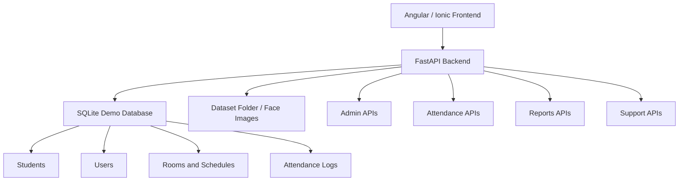

# FRAS — Facial Recognition Attendance System


**FRAS** is a full-stack facial recognition attendance platform built for classroom and institutional attendance workflows. It combines a modern Angular/Ionic dashboard with a FastAPI backend, student face registration, attendance monitoring, reporting, admin controls, room scheduling, analytics, and support ticket handling.

The system is designed for thesis demonstration, school operations, and future production hardening where attendance can be captured, reviewed, exported, and managed from a centralized web application.

---

## Project Snapshot

| Area | Details |
|---|---|
| Project Name | FRAS — Facial Recognition Attendance System |
| Frontend | Angular 18, Ionic UI, TypeScript |
| Backend | FastAPI, Python |
| Database | SQLite for demo/local branch, PostgreSQL-compatible deployment path |
| Core Domain | Student attendance, face registration, classroom schedules, reports |
| Primary Users | Super Admin, Admin, Instructor, Student |
| Demo Focus | Clean attendance workflow, visual admin dashboard, face-data readiness, report exports |

---

## Core Modules

### Authentication and Role-Based Access

FRAS includes login, protected routes, role-based access, admin guards, and user-specific dashboard access. The platform separates access between administrative users, instructors, and students.

### Student Registration and Face Data Capture

The system supports student registration, student number tracking, class association, image capture, local dataset storage, and face-data path management for recognition readiness.

### Attendance Monitoring

The attendance monitor module is designed to support face-based attendance workflows, record attendance activity, and connect recognized students to stored attendance logs.

### Attendance Logs and Reports

Admins can review attendance history, filter records, and generate report outputs for class-based or professor-based review. Export-oriented workflows are included for CSV, Excel, and PDF-style reporting.

### Room and Schedule Management

The platform includes room schedule viewing and editing so classroom schedules can be managed alongside attendance operations.

### Admin User Management

The admin panel includes user listing, account status handling, role/user-type visibility, password reset workflows, and permission-based administrative tools.

### System Analytics

FRAS includes system-wide metrics for students, instructors, attendance records, recent attendance activity, and face registration readiness. This module is planned for visual chart improvements in the next update.

### Support Ticket System

Users can submit support concerns and administrators can review support tickets from the admin dashboard.

### System Settings

The settings module centralizes configurable system values used by the attendance platform.

---

## Current Demo Database Snapshot

The latest deployed branch includes a prepared SQLite demo database with sample data suitable for presentation and local testing.

| Data Area | Included |
|---|---:|
| Users | Yes |
| Students | Yes |
| Instructors | Yes |
| Rooms | Yes |
| Courses | Yes |
| Classes | Yes |
| Enrollments | Yes |
| Attendance Logs | Yes |
| Support Tickets | Yes |

---

## System Architecture



---

## Repository Structure

```txt
FRAS/
├── api/                     # FastAPI routers and backend modules
├── config/                  # Default system settings and configuration helpers
├── database/                # Database-related support files
├── dataset/                 # Registered student face image folders
├── docs/                    # Project setup, deployment, demo, and troubleshooting docs
├── facial-attendance/       # Angular/Ionic frontend application
├── models/                  # Backend data/model helpers
├── repositories/            # Database access and persistence layer
├── services/                # Shared backend services such as database connections
├── backend.py               # Official FastAPI backend entry point
├── attendance.db            # SQLite demo database for the current branch
├── database_indexes.sql     # Database index/constraint helper script
├── docker-compose.prod.yml  # Production-oriented compose file
└── README.md                # Project showcase overview
```

---

## Documentation

Detailed usage and operational instructions are intentionally separated from this showcase README.

| Document | Purpose |
|---|---|
| [`docs/SETUP.md`](docs/SETUP.md) | Local development setup and run guide |
| [`docs/DEMO_GUIDE.md`](docs/DEMO_GUIDE.md) | Suggested thesis/demo presentation flow |
| [`docs/DEPLOYMENT.md`](docs/DEPLOYMENT.md) | Deployment notes and environment strategy |
| [`docs/TROUBLESHOOTING.md`](docs/TROUBLESHOOTING.md) | Common issues and quick fixes |
| [`docs/ROADMAP.md`](docs/ROADMAP.md) | Next planned improvements and patch sequence |

---

## Current Stabilization Direction

This branch is being cleaned and upgraded through small PR-based updates. The immediate priority is to make FRAS more stable, easier to review, and more presentation-ready.

Planned upgrade sequence:

1. Documentation, environment, and repo cleanup
2. Docker/environment correction
3. Panel feedback UI fixes
4. Duplicate room protection
5. Attendance report display improvements
6. Analytics graphs and clearer face-registration metrics
7. Repeatable demo data reset workflow
8. Authentication and deployment hardening

---

## Project Value

FRAS is more than a simple attendance tracker. It demonstrates a complete institutional workflow:

- Face-data registration
- Attendance capture
- Administrative review
- Schedule and room context
- Report generation
- User management
- Support ticket handling
- System analytics
- Deployment-aware backend/frontend separation

This makes it a strong thesis and portfolio project because it combines real-world school operations with full-stack software development and computer vision support.
