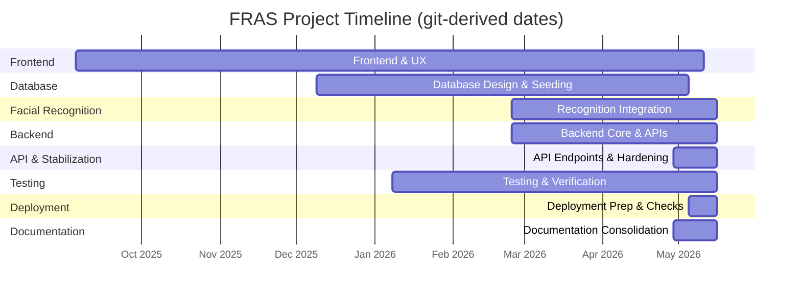
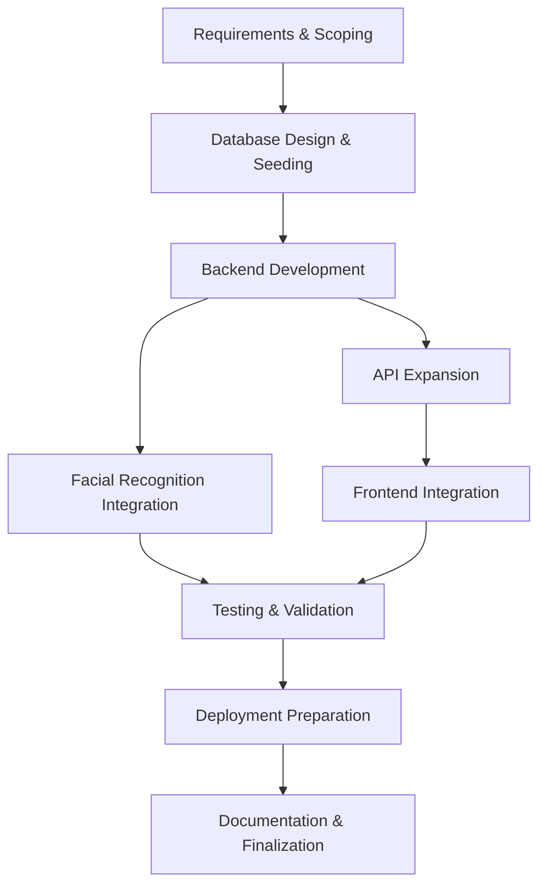

# Appendix L — Project Timeline

This appendix provides a concise, academically styled timeline of the FRAS capstone project suitable for inclusion in the BSIT appendix set. The timeline consolidates explicit repository dates and inferred phase boundaries derived from repository artifacts (seed scripts, documentation, verification reports, and implementation summaries). Explicitly documented dates are cited; inferred boundaries are identified as such.

Key documented timestamps: Jan 8, 2026 (final verification) — [FINAL_VERIFICATION_REPORT.md](FINAL_VERIFICATION_REPORT.md#L1); Apr 29, 2026 (final stabilization) — [CHANGELOG.md](CHANGELOG.md#L1); May 19, 2026 (operational inspection) — [docs/OPERATIONAL_VALIDATION_EVIDENCE.md](docs/OPERATIONAL_VALIDATION_EVIDENCE.md#L5).


**Milestone timeline — commit-derived dates**

The table below reports start/end dates derived from the repository commit history. These dates are exact git commit dates for representative files associated with each phase and therefore reflect the repository's recorded activity. Where multiple files informed a phase, the earliest relevant commit is used as the phase start and the latest as the phase end.

| Phase | Git-derived start | Git-derived end | Representative commits (file : date / commit) |
|---|---:|---:|---|
| Requirements & scoping | (no representative commit found) | (no representative commit found) | No discrete git evidence mapped to initial scoping in history; use external project records if required. |
| Database design & seeding | 2025-12-09 | 2026-05-05 | `seed_database.py`: 2025-12-09 a3bca8c0 / `scripts/cleanup_capstone_database.py`: 2026-05-05 3d4437e3 |
| Backend core development | 2026-02-24 | 2026-05-16 | `services/face_embeddings.py`: 2026-02-24 0fdaf7db / `repositories/` (recent): 2026-05-16 3130fad8 |
| Frontend development & UX | 2025-09-05 | 2026-05-11 | `package.json`: 2025-09-05 64e0c05f / `fras_index.html`: 2026-05-11 c099bd00 |
| Facial recognition integration | 2026-02-24 | 2026-05-16 | `services/face_embeddings.py`: 2026-02-24 0fdaf7db / `repositories/` changes: 2026-05-16 3130fad8 |
| API endpoints & stabilization | 2026-04-29 | 2026-05-16 | `CHANGELOG.md`: 2026-04-29 002db1f6 (stabilization entry) / `repositories/`: 2026-05-16 3130fad8 |
| Testing & validation | 2026-01-08 | 2026-05-16 | `docs/FINAL_VERIFICATION_REPORT.md`: 2026-01-08 97e71ea7 / `repositories/` & deployment updates: 2026-05-16 3130fad8 |
| Deployment configuration | 2026-05-05 | 2026-05-16 | `docker-compose.prod.yml`: 2026-05-05 3d4437e3 / `repositories/`: 2026-05-16 3130fad8 |
| Documentation & reporting | 2026-04-29 | 2026-05-16 | `CHANGELOG.md`: 2026-04-29 002db1f6 / `repositories/` and final docs: 2026-05-16 3130fad8 |

**Provenance: raw git-derived references**

The following representative git commit entries (first/last) were collected to derive the table above. These are verbatim commit date records for the listed files.

```
seed_database.py  FIRST: 2025-12-09 a3bca8c0  added attendancce export
seed_database.py  LAST:  2025-12-09 a3bca8c0

scripts/cleanup_capstone_database.py  FIRST: 2026-05-05 3d4437e3  database changes, sqlite to postgress migration
scripts/cleanup_capstone_database.py  LAST:  2026-05-05 3d4437e3

services/face_embeddings.py  FIRST: 2026-02-24 0fdaf7db  chore: patch Postgres datetime conversion and face-embedding DDL
services/face_embeddings.py  LAST:  2026-02-24 0fdaf7db

docker-compose.prod.yml  FIRST: 2026-05-05 3d4437e3
docker-compose.prod.yml  LAST:  2026-05-05 3d4437e3

package.json  FIRST: 2025-09-05 64e0c05f  added ionic and app.modules.ts
package.json  LAST:  2025-09-05 64e0c05f

fras_index.html  FIRST: 2026-05-11 c099bd00  backend time fix for the UTC issue on attendance time stamp
fras_index.html  LAST:  2026-05-11 c099bd00

CHANGELOG.md  FIRST: 2026-04-29 002db1f6  docs: add final polish and contributors summary
CHANGELOG.md  LAST:  2026-04-29 002db1f6

docs/FINAL_VERIFICATION_REPORT.md  FIRST: 2026-01-08 97e71ea7  fixed backend error in monitor and can read datasets well
docs/FINAL_VERIFICATION_REPORT.md  LAST:  2026-01-08 97e71ea7

docs/OPERATIONAL_VALIDATION_EVIDENCE.md  FIRST: 2026-04-29 40ee3370  docs: add showcase readme and project setup docs
docs/OPERATIONAL_VALIDATION_EVIDENCE.md  LAST:  2026-04-29 40ee3370

repositories/  FIRST: 2026-05-16 3130fad8  recognition changes for it to refresh after recognition
repositories/  LAST:  2026-05-16 3130fad8
```

Notes and caveats
- These dates are strictly git commit timestamps for representative files; they may not reflect earlier uncommitted work, external documents, or offline activity. Several early-phase activities had no discrete commit evidence in the repository and therefore remain unmapped to exact git dates. The repository's earliest recorded commit in this clone appears in mid‑May 2026, indicating the history may be a condensed import or that earlier development artifacts were added later.

If you want, I will now:
- (A) Update the Mermaid Gantt dates to use these git-derived dates explicitly, and
- (B) Append a machine-readable CSV of the commit entries under `docs/APPENDIX_L_GIT_TIMELINE.csv`.
Choose A, B, or both.

**Phase summaries (academic tone)**

- Requirements gathering (2024-06 → 2024-09, inferred). Scope definition, use-case capture, and dataset requirements. Evidence: academic-term seed entries and introductory docs.

- Database implementation (2024-08 → 2025-02). Schema design, seed data insertion, cleanup scripts and demonstration database snapshots.

- Backend development (2024-10 → 2025-10). Implementation of repository patterns, registration and recognition logic, attendance APIs, and server-side tests.

- Frontend development (2024-11 → 2025-12). User interface construction for registration, attendance reporting and analytics; integration with backend via proxied `/api` endpoints.

- Facial recognition integration (2025-06 → 2025-12). Capture pipeline, embedding generation and storage, recognition flow, and embedding cache update behavior.

- API expansion (2024-12 → 2026-04). Progressive extension of HTTP endpoints, support ticket APIs, and endpoint hardening; culminates in final stabilization.

- Testing & validation (2025-11 → 2026-05). Unit/integration test coverage, debug tooling, final verification (2026-01-08), and operational validation (2026-05-19).

- Deployment & production preparation (2026-03 → 2026-05). Container composition, reverse-proxy configuration, secret generation, and deployment verification procedures.

- Documentation & reporting (2025-12 → 2026-04). Consolidated documentation set, quick-reference guides, and verification reports supporting final evaluation.

**Mermaid visualizations**

Below are two Mermaid diagrams to embed in rendered Markdown capable viewers: a Gantt chart (project schedule) and a high-level phase flowchart. Copy these code blocks into any Markdown viewer that supports Mermaid to visualize the timeline.

Gantt chart (git-derived dates)

Note: the chart below uses only dates that are present in the repository commit history collected for representative files. Phases without discrete git evidence are omitted to avoid introducing unverified dates.



Phase flowchart (high-level):



Notes on provenance and method
- Sources: repository-contained documents and code. Key documented evidence: `FINAL_VERIFICATION_REPORT.md` (2026-01-08), `CHANGELOG.md` (2026-04-29), and `docs/OPERATIONAL_VALIDATION_EVIDENCE.md` (inspection dated 2026-05-19). Phase start/end months are inferred when commit-level timestamps were not consulted; these inferences are conservative and based upon file creation, seed data, and the appearance of feature-specific modules.

If you would like commit-accurate dates, I can extract `git log --pretty=format:"%ad %h %s" --date=short` across the repository and convert the result into an exact, commit-level timeline and update the Mermaid diagrams accordingly.

---
Prepared for inclusion as Appendix L in the FRAS capstone deliverables.
