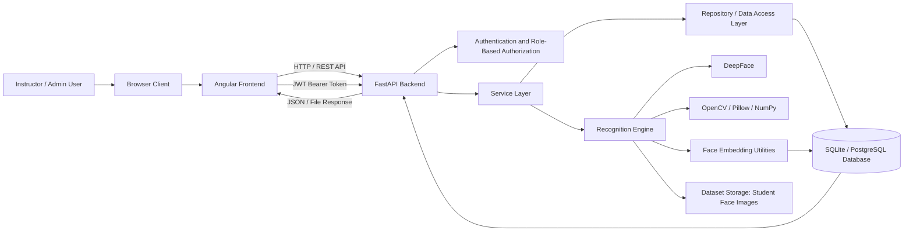
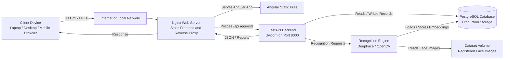
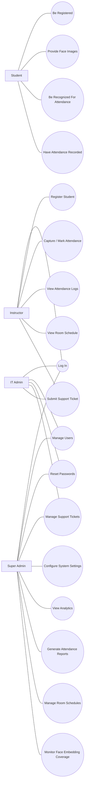
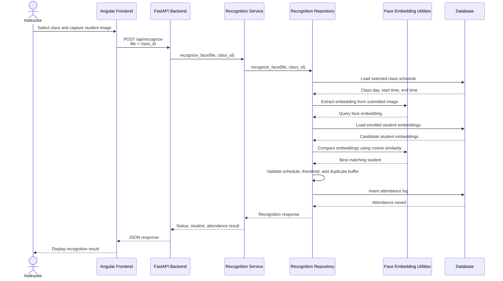
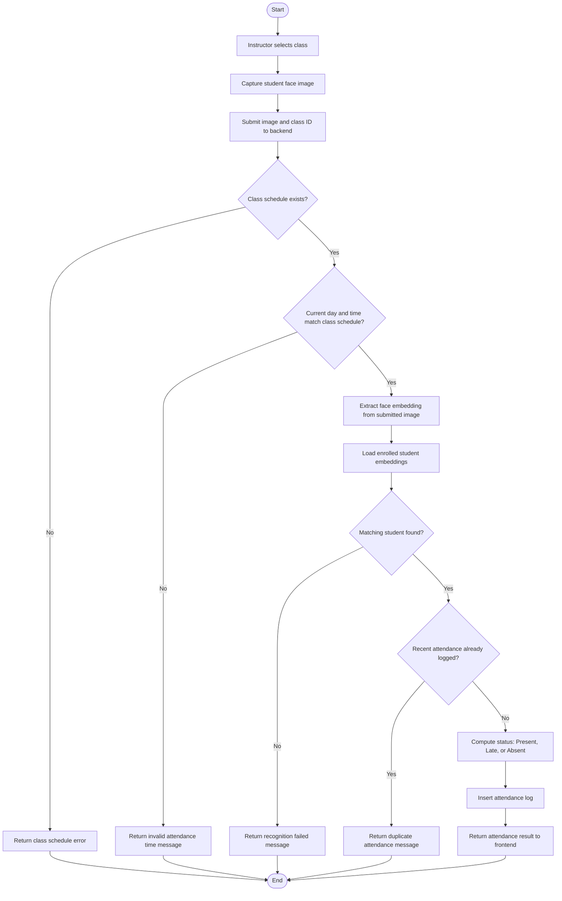

# FRAS System Reverse-Engineering Notes

This document summarizes the implemented Facial Recognition Attendance System (FRAS) based on the current codebase. It is intended as source material for the capstone paper, especially the system architecture, methodology, system design, and implementation chapters.

## 1. Architecture And Technical Stack

### System Overview

FRAS is a web-based facial recognition attendance system composed of an Angular frontend, a FastAPI backend, a relational database layer, and a facial recognition pipeline. The system allows authorized users to log in, register students, capture face images, recognize student attendance during scheduled classes, view attendance logs, manage rooms and schedules, administer users, generate reports, configure system settings, and submit or manage support tickets.

The application follows a layered architecture:

1. Presentation Layer: Angular single-page application under `facial-attendance/src/app`.
2. API Layer: FastAPI application in `backend.py` and route modules under `api/`.
3. Service Layer: Business logic coordinators under `services/`.
4. Repository/Data Access Layer: Database access modules under `repositories/`.
5. Persistence Layer: SQLite for local/demo use and PostgreSQL for production deployment.
6. Face Recognition Layer: DeepFace, OpenCV, Pillow, NumPy, and database-cached face embeddings.
7. Deployment Layer: Docker, Docker Compose, PostgreSQL, Nginx, and Uvicorn.

### Backend Stack

| Component | Version | Role In The System |
|---|---:|---|
| Python | 3.11 slim container | Runtime environment for the backend service. |
| FastAPI | 0.115.6 | Web API framework for defining REST endpoints and request validation. |
| Uvicorn | 0.34.0 | ASGI server used to run `backend:app` on port 8000. |
| Pydantic | 2.10.5 | Data validation and response modeling for API schemas. |
| PyJWT | 2.10.1 | JWT authentication token creation and verification. |
| Passlib bcrypt | 1.7.4 | Password hashing and password verification. |
| python-multipart | 0.0.20 | Multipart form upload support for images and registration forms. |
| OpenCV headless | 4.10.0.84 | Image-processing dependency used by the facial recognition pipeline. |
| Pillow | 11.1.0 | Image handling support. |
| NumPy | 1.26.4 | Numerical vector operations used with image embeddings. |
| DeepFace | 0.0.93 | Face recognition and embedding extraction. |
| tf-keras | 2.21.0 | Deep learning backend compatibility for DeepFace models. |
| psycopg2-binary | 2.9.10 | PostgreSQL database driver for production deployment. |
| APScheduler | 3.11.0 | Dependency for scheduled attendance-related automation, although scheduler usage is currently partly commented. |
| openpyxl | 3.1.5 | Excel report generation. |
| reportlab | 4.2.5 | PDF report generation. |
| boto3 | 1.35.99 | Optional AWS S3 support for student face folders. |
| requests | 2.32.3 | HTTP utility library. |

### Frontend Stack

| Component | Declared Version | Locked/Resolved Version | Role In The System |
|---|---:|---:|---|
| Angular | ^18.2.0 | 18.2.13 core | Main frontend framework. |
| Angular CLI | ^18.2.20 | 18.2.20 | Build, serve, and test tooling. |
| Angular Router | ^18.2.0 | 18.x | Client-side navigation and route guards. |
| Angular Forms | ^18.2.0 | 18.x | Login, registration, settings, schedule, and admin forms. |
| Angular SSR package | ^18.2.9 | 18.x | Present in dependencies, but SSR is disabled in `angular.json`. |
| Ionic Angular | ^8.7.3 | 8.7.3 | UI framework dependency. |
| ngx-webcam | ^0.4.1 | 0.4.1 | Webcam capture support for attendance recognition. |
| RxJS | ~7.8.0 | 7.8.2 | Observable-based HTTP and UI data flow. |
| TypeScript | ~5.5.2 | 5.5.4 | Frontend language and compilation. |
| Zone.js | ~0.14.10 | 0.14.10 | Angular change detection support. |
| Express | ^4.18.2 | 4.21.2 | Present for server-related Angular tooling. |

### Database And Deployment

| Component | Version/Configuration | Role In The System |
|---|---|---|
| SQLite | Local `attendance.db` fallback | Local development and demo database. |
| PostgreSQL | `postgres:16-alpine` | Production relational database in Docker Compose. |
| Nginx | `nginx:stable-alpine` | Serves the built Angular frontend and proxies API traffic in deployment. |
| Docker | `Dockerfile` based on `python:3.11-slim` | Packages the backend with image-processing system libraries. |
| Docker Compose | `docker-compose.prod.yml` | Orchestrates database, backend, frontend, and migration tool services. |
| Uvicorn container command | `uvicorn backend:app --host 0.0.0.0 --port 8000` | Starts the backend API. |

The database wrapper in `services/db.py` allows the same repository code to run on SQLite or PostgreSQL. If `DATABASE_URL` is set, the system uses PostgreSQL; otherwise, it uses the local SQLite database. For PostgreSQL compatibility, the wrapper adapts SQLite-style `?` SQL parameters into `%s` placeholders.

### System Architecture Diagram

The FRAS system follows a layered client-server architecture. The Angular frontend provides the user interface and sends HTTP requests to the FastAPI backend. The backend receives API requests, applies authentication and authorization rules, coordinates business logic through service modules, and persists records through repository modules. The facial recognition engine is integrated into the backend and uses DeepFace, OpenCV, NumPy, and stored face embeddings to identify students. The database layer stores academic records, users, permissions, system settings, support tickets, attendance logs, and face embeddings, while the dataset storage contains registered face images.

Figure 1. System architecture of the Facial Recognition Attendance System showing the frontend, backend API, authentication layer, recognition engine, database, dataset storage, and API response flow.

### Network Architecture Diagram

In deployment, users access the system through a browser on a client device connected through the internet or a local network. Nginx serves the compiled Angular frontend and forwards API traffic to the FastAPI backend running on Uvicorn. The backend communicates with the PostgreSQL database for persistent records and invokes the recognition engine during student registration and attendance marking. In the Docker Compose deployment, these components run as separate services; in the manual VPS deployment, Nginx proxies requests to a Uvicorn backend service running locally on the server.

Figure 2. Network architecture of the deployed FRAS environment showing the client device, network path, Nginx frontend and reverse proxy, FastAPI backend, recognition engine, PostgreSQL database, and dataset storage.

### Use Case Diagram

The FRAS use case diagram identifies the main user roles and the functions each role can perform in the system. Students are represented as attendance subjects whose information, face data, schedules, and attendance records are managed by the system. Instructors perform the daily academic workflows such as logging in, registering students, capturing attendance, viewing logs, and submitting support tickets. IT administrators support operations by managing users, resetting passwords, monitoring support tickets, and assisting with technical issues. Super administrators have the broadest privileges, including system configuration, analytics, report generation, user management, and administrative monitoring.

Figure 3. Use case diagram of FRAS showing the Student, Instructor, IT Admin, and Super Admin actors and their major interactions with the system.

### Sequence Diagram: Attendance Recognition Flow

The sequence diagram shows the interaction between the instructor, frontend, backend API, recognition service, recognition repository, face embedding utilities, and database during facial recognition-based attendance marking. The process begins when an instructor captures a student image from the attendance monitor. The frontend sends the image and selected class ID to the backend, which extracts the submitted face embedding, compares it with enrolled student embeddings, validates the class schedule, computes the attendance status, and stores the attendance log.

Figure 4. Sequence diagram of the FRAS attendance recognition process from image capture to attendance log creation.

### Activity Diagram: Attendance Marking Process

The activity diagram describes the decision flow used by the system when marking attendance. After receiving the captured image and selected class, the backend verifies the class schedule, processes the face image, compares the face against enrolled students, checks for duplicate attendance within the configured buffer, computes the correct attendance status, and records the result. If any validation step fails, the system returns an error or failed recognition message instead of creating an attendance record.

Figure 5. Activity diagram of the FRAS attendance marking process showing recognition, validation, duplicate checking, status computation, and attendance logging.

## 2. Data Flow And API Endpoint Map

### Primary Data Flow

1. User Authentication
   The Angular login page submits email and password to `/api/login`. The backend verifies the account across the consolidated `users` table or legacy role tables, validates the password, generates a JWT, and returns the user type, permissions, and user ID.

2. Authorized Frontend Requests
   Angular route guards control page access, and `AuthInterceptor` attaches the JWT as `Authorization: Bearer <token>` to outgoing HTTP requests.

3. Student Registration
   The frontend sends multipart form data to `/api/registration`, including student information, schedule data, and face images. The backend creates or updates the student, enrolls the student in matching classes, saves face images under `DATASET_PATH/{student_number}`, extracts a face embedding, and stores the embedding in `student_face_embeddings`.

4. Attendance Recognition
   The attendance monitor captures an image and sends it with a selected `class_id` to `/api/recognize`. The recognition repository compares the uploaded face against enrolled student embeddings, validates that the class is active for the current Manila date/time, determines Present/Late/Absent based on system settings, prevents duplicate logs within the configured buffer, and writes the attendance result to `attendance_logs`.

5. Attendance Viewing And Reporting
   Attendance logs are retrieved through `/api/attendance`. Admin report endpoints aggregate attendance records and generate JSON, CSV, Excel, or PDF outputs depending on the report request.

6. Administration And Configuration
   Admin endpoints manage users, password resets, analytics, face embedding coverage, support tickets, and system settings. Settings are cached in `SettingsService` and influence recognition thresholds, attendance thresholds, duplicate buffers, and automation behavior.

### API Endpoints

| Feature Area | Method | Endpoint | Expected Request | Main Response |
|---|---|---|---|---|
| Authentication | POST | `/api/login` | JSON: `email`, `password` | JWT token, token type, user type, permissions, user ID |
| Authentication | POST | `/login` | JSON: `email`, `password` | Backward-compatible alias of `/api/login` |
| Attendance Recognition | POST | `/api/recognize` | Multipart: `file`, `class_id` | Recognition status, student ID/name, attendance status, message |
| Automatic Absence | POST | `/api/mark-absents` | Multipart: `class_id`, `date` | Result of absence marking |
| Attendance Logs | GET | `/api/attendance` | Query: `course_code`, `section`, optional `room`, `start_date`, `end_date` | Attendance record list |
| Student Registration | POST | `/api/registration` | Multipart: student fields, JSON schedule string, face image files | Registration status, message, saved image paths |
| Legacy Student Registration | POST | `/api/register` | Multipart student registration form | Registration result |
| User Registration | POST | `/api/user/register` | JSON: `email`, `password` | User registration result |
| Image Capture | POST | `/api/capture` | Multipart: `file`, `course_code`, `section`, `student_id` | Capture status and saved file metadata |
| Rooms | GET | `/api/rooms` | None | List of rooms |
| Rooms | GET | `/api/floors` | None | List of floor levels |
| Rooms | GET | `/api/floors/{floor_level}/rooms` | Path: floor level | Rooms on selected floor |
| Rooms | GET | `/api/rooms/{room_id}/courses` | Path: room ID | Courses associated with room |
| Rooms | GET | `/api/rooms/{room_id}/courses-sections` | Path: room ID | Course-section combinations for room |
| Rooms | GET | `/api/rooms/{room_id}/courses/{course_code}/sections` | Path: room ID and course code | Sections for course in room |
| Schedule | GET | `/api/room-schedule/{room_id}` | Path: room ID/code | Room schedule list |
| Schedule | POST | `/api/room-schedule/{room_id}` | JSON schedule payload | Updated room schedule |
| Schedule | DELETE | `/api/room-schedule/{room_id}` | Path: room ID/code | Delete result |
| Courses | GET | `/api/courses` | None | Course list |
| Courses | GET | `/api/courses/{course_code}/sections` | Path: course code | Section list |
| Instructors | GET | `/api/instructors` | None | Instructor list |
| Students | GET | `/api/students` | None | Student list |
| Students | GET | `/api/students/{student_number}` | Path: student number | Student details |
| Classes | GET | `/api/classes` | None | Class list |
| Admin Users | GET | `/api/admin/users` | Bearer token with `manage_users` | User list |
| Admin Users | POST | `/api/admin/users` | JSON: email, password, user type, names | Created user |
| Admin Users | PUT | `/api/admin/users/{user_id}` | JSON user updates | Updated user |
| Admin Users | DELETE | `/api/admin/users/{user_id}` | Path: user ID | Delete result |
| Admin Users | POST | `/api/admin/reset-password` | JSON: `email`, optional `new_password` | Password reset result |
| Admin Users | POST | `/api/admin/users/bulk` | JSON: `operation`, `user_ids` | Bulk operation result |
| Settings | GET | `/api/admin/system-settings` | Bearer token with `system_config` | System settings |
| Settings | PUT | `/api/admin/system-settings` | JSON: `setting_key`, `setting_value` | Updated setting |
| Settings | PUT | `/api/admin/system-settings/bulk` | JSON array of key/value updates | Bulk update result |
| Analytics | GET | `/api/admin/analytics` | Bearer token with analytics permission | Dashboard analytics |
| Face Data Audit | GET | `/api/admin/face-embedding-coverage` | Bearer token with data permission | Face data/embedding coverage metrics |
| Face Data Audit | GET | `/api/debug/face-embedding-coverage-public` | None | Public debug coverage metrics |
| Admin Automation | POST | `/api/admin/mark-automatic-absents` | Empty JSON body | Automatic absent marking result |
| Support | POST | `/api/support/tickets` | JSON: subject, description, category, priority | Created ticket |
| Support Admin | GET | `/api/admin/support/tickets` | Optional query: status, priority | Ticket list |
| Support Admin | PUT | `/api/admin/support/tickets/{ticket_id}` | JSON: status, priority, assigned user | Updated ticket |
| Support Admin | POST | `/api/admin/support/tickets/{ticket_id}/replies` | JSON: message, internal flag | Created reply |
| Support Admin | GET | `/api/admin/support/tickets/{ticket_id}/replies` | Path: ticket ID | Ticket replies |
| Reports | POST | `/api/admin/attendance/export` | JSON report filters and format | Attendance report data or file |
| Reports | POST | `/api/admin/attendance/export/professor` | JSON professor report filters and format | Professor-based report data or file |
| Debug | GET | `/api/routes` | None | Registered API route list |
| Debug | GET | `/test` | None | Test response |
| Debug | POST | `/test-bulk` | Test payload | Bulk test response |

## 3. Component Responsibilities

### Frontend Components And Services

| File/Area | Responsibility | Interaction With Other Parts |
|---|---|---|
| `facial-attendance/src/app/api.service.ts` | Central HTTP client for attendance, recognition, rooms, schedules, students, admin, settings, support, analytics, and reports. | Calls backend REST endpoints and returns RxJS Observables to components. |
| `facial-attendance/src/app/auth.service.ts` | Stores and retrieves authentication state and JWT tokens. | Used by guards and HTTP interceptor. |
| `facial-attendance/src/app/auth.interceptor.ts` | Adds bearer token authorization headers to outgoing requests. | Connects frontend authenticated sessions to protected backend endpoints. |
| `facial-attendance/src/app/auth.guard.ts` | Protects routes based on login state and permissions. | Uses stored user permissions from authentication flow. |
| `facial-attendance/src/app/super-admin.guard.ts` | Restricts system settings routes to super admin users. | Enforces highest-level administrative access. |
| `attendance-monitor` and `webcam-capture` components | Capture images and submit them for recognition. | Uses `/api/recognize`, room/floor/class endpoints, and webcam support. |
| `attendance-logs` component | Displays attendance records by course, section, and date range. | Calls `/api/attendance`. |
| `register-students` and `registration` components | Register student information and face images. | Calls `/api/registration` or legacy registration endpoints. |
| `room-schedule` and `room-schedule-editor` components | View and edit room schedules. | Calls schedule, room, course, instructor, and section APIs. |
| Admin components | User management, password reset, analytics, settings, support tickets, and reports. | Call `/api/admin/*` endpoints. |

### Backend API Layer

| File | Primary Responsibility | Key Interactions |
|---|---|---|
| `backend.py` | Main FastAPI application, middleware/CORS setup, database initialization, direct endpoints, and router inclusion. | Imports routers from `api/` and services from `services/`. |
| `api/auth.py` | Login, JWT creation, user type detection, password verification, and permission loading. | Reads users/role tables through `services.db`; used by admin permission dependencies. |
| `api/recognition.py` | Defines face recognition and absent-marking endpoints. | Delegates to `RecognitionService`. |
| `api/registration.py` | Defines student registration endpoint with multipart image upload. | Delegates to `RegistrationService`. |
| `api/capture.py` | Defines image capture endpoint. | Delegates to `CaptureService`. |
| `api/attendance.py` | Defines attendance retrieval endpoint. | Delegates to `AttendanceService`. |
| `api/schedule.py` | Defines room schedule retrieval, update, and delete endpoints. | Delegates to `ScheduleService`. |
| `api/admin.py` | Admin user management, system settings, analytics, support tickets, face embedding coverage, automatic absence marking, and report generation. | Uses authentication dependencies, database access, settings service, and report libraries. |
| `api/course_students.py` and `api/student_courses.py` | Registration helper endpoints for course/student relationships. | Query repository/database data for enrollment-related UI features. |
| `api/debug.py` | Lists registered routes for debugging. | Reads FastAPI app route metadata. |

### Service Layer

| File | Responsibility | Key Interactions |
|---|---|---|
| `services/db.py` | Provides a database connection abstraction over SQLite and PostgreSQL. | Used by repositories and admin/auth code. |
| `services/recognition_service.py` | Service wrapper for recognition business operations. | Delegates recognition and absence marking to `RecognitionRepository`. |
| `services/registration_service.py` | Parses registration schedule JSON and coordinates registration. | Delegates persistence and image handling to `RegistrationRepository`. |
| `services/attendance_service.py` | Formats attendance records and runs automatic absent marking. | Uses `AttendanceRepository`, `RecognitionRepository`, and `SettingsService`. |
| `services/capture_service.py` | Coordinates capture image processing. | Delegates to `CaptureRepository`. |
| `services/schedule_service.py` | Coordinates schedule operations. | Delegates to `ScheduleRepository`. |
| `services/room_service.py` | Coordinates room/floor/course-section retrieval. | Delegates to `RoomRepository`. |
| `services/settings_service.py` | Loads, caches, and exposes configurable system settings. | Used by recognition, attendance, admin, and repository code. |
| `services/face_embeddings.py` | Creates, stores, loads, parses, and compares face embeddings. | Used by registration and recognition repositories. |
| `services/s3_utils.py` | Optional S3 folder download/listing utilities. | Used by recognition repository when face folders are stored remotely. |
| `services/room_codes.py` | Normalizes room numbers and derives floor levels. | Used by room and schedule logic. |

### Repository/Data Access Layer

| File | Responsibility | Key Interactions |
|---|---|---|
| `repositories/recognition_repo.py` | Performs face matching, class schedule validation, attendance status calculation, duplicate attendance prevention, and attendance log insertion. | Uses DeepFace, `face_embeddings`, `settings_service`, `s3_utils`, and `attendance_logs`. |
| `repositories/registration_repo.py` | Creates/updates student records, enrollments, image folders, face paths, and cached embeddings. | Writes to students, enrollments, dataset folders, and `student_face_embeddings`. |
| `repositories/attendance_repo.py` | Fetches attendance logs by course, section, optional room, and date range. | Joins courses, classes, students, attendance logs, and status tables. |
| `repositories/capture_repo.py` | Saves captured face images and related metadata. | Uses dataset storage and database records. |
| `repositories/schedule_repo.py` | Reads and updates room schedules and class relationships. | Uses rooms, classes, courses, instructors, and schedule-related tables. |
| `repositories/room_repo.py` | Fetches rooms, floors, courses, and sections for room-based UI selection. | Used by room and attendance monitor UI workflows. |
| `repositories/student_repo.py` | Student database operations. | Supports student lookup/listing behavior. |
| `repositories/course_repo.py`, `class_repo.py`, `instructor_repo.py`, `enrollment_repo.py` | Focused database repositories for academic entities. | Support registration, schedule, and reporting workflows. |
| `repositories/attendance_log_repo.py` | Attendance log data access utilities. | Supports report and attendance workflows. |

## 4. Suggested Capstone Wording

The implemented system uses a client-server architecture in which the Angular frontend provides the user interface for attendance monitoring, student registration, schedule management, and administration. The FastAPI backend exposes RESTful endpoints that receive requests from the frontend, validate the request data, and delegate business operations to service and repository modules. The repository layer abstracts database operations and supports both SQLite for local development and PostgreSQL for production deployment. Facial recognition is implemented through DeepFace-based embedding extraction and comparison, with student face embeddings stored in the database to improve recognition performance and reduce repeated image processing.

Attendance marking is controlled by class schedules and configurable system settings. When an instructor captures a student image, the backend verifies the selected class, compares the submitted face with enrolled student embeddings, checks whether the current Manila time falls within the scheduled class period, computes the attendance status based on late and absent thresholds, and records the result in the attendance log. Administrative users can manage accounts, review analytics, configure recognition and attendance thresholds, generate reports, and handle support tickets through protected API endpoints secured by JWT authentication and role-based permissions.

## 5. Technical Implementation Summary

The completed FRAS system was implemented as a full-stack web application for managing classroom attendance through facial recognition. The system combines an Angular-based client application, a FastAPI backend, a relational database layer, a role-based authentication model, a DeepFace-powered recognition engine, and a production deployment architecture using Docker, PostgreSQL, Nginx, and Uvicorn.

### Frontend Implementation

The frontend was developed as an Angular single-page application located in the `facial-attendance` directory. It provides the main user interface for attendance monitoring, student registration, schedule viewing and editing, attendance log review, administrative management, system settings, analytics, support ticket handling, and report generation.

Angular routing is used to organize the system into functional pages such as the attendance monitor, attendance logs, room schedules, registration pages, login page, and administrative pages. Route guards enforce access control by checking whether the user is logged in and whether the user has the required role or permission for a page. The frontend also uses an HTTP interceptor to attach the JWT bearer token to authenticated API requests.

The main frontend communication layer is `api.service.ts`, which centralizes calls to backend endpoints. This service handles requests for recognition, attendance logs, room and schedule data, student records, user management, system settings, analytics, support tickets, and report exports. Webcam-based attendance capture is supported through the frontend capture components and the `ngx-webcam` dependency.

### Backend Implementation

The backend was implemented using FastAPI and is started through Uvicorn using the application entry point `backend:app`. The backend exposes RESTful API endpoints for authentication, facial recognition, student registration, image capture, attendance logs, rooms, schedules, courses, students, classes, administrative functions, support tickets, analytics, and report generation.

The backend follows a layered structure. API route files under the `api/` directory receive HTTP requests and validate request data. Service modules under `services/` coordinate business logic. Repository modules under `repositories/` perform database access and persistence operations. This structure separates request handling, business rules, and data access so that major system functions can be maintained independently.

The backend supports multipart form requests for face image uploads and JSON requests for administrative, authentication, settings, support, and reporting functions. CORS middleware is configured to allow frontend-to-backend communication during local development, while production deployment places the frontend and API behind Nginx.

### Database Implementation

The persistence layer supports both SQLite and PostgreSQL. SQLite is used for local development, testing, and demonstration through the local `attendance.db` file. PostgreSQL is used for the production deployment through the `postgres:16-alpine` Docker service.

The system uses a database compatibility wrapper in `services/db.py`. If `DATABASE_URL` is configured, the backend connects to PostgreSQL using `psycopg2`; otherwise, it falls back to SQLite. The wrapper adapts SQLite-style parameter placeholders to PostgreSQL-compatible placeholders, allowing much of the repository code to work across both database engines.

The database stores academic and operational records including students, instructors, courses, rooms, classes, enrollments, attendance logs, attendance status types, users, permissions, role permissions, system settings, support tickets, ticket replies, and student face embeddings. Student face images are stored in the dataset directory, while extracted face vectors are stored in the `student_face_embeddings` table for faster recognition.

### Authentication And Authorization

Authentication is handled through the `/api/login` endpoint. Users submit an email and password, and the backend verifies the account against the consolidated `users` table or supported legacy role tables. Password verification supports hashed passwords through Passlib and also includes compatibility for existing plain password records when present.

After successful login, the backend issues a JWT access token containing the user identity, user type, permissions, and user ID. The frontend stores the token and attaches it to subsequent requests using the `Authorization: Bearer <token>` header. Protected backend endpoints decode and validate the token before granting access.

Authorization is role-based and permission-based. The system supports instructor, IT administrator, and super administrator access levels. Instructors can access attendance and registration workflows, IT administrators can assist with user and support operations, and super administrators have full access to system settings, analytics, user management, reports, and higher-level administrative functions.

### Recognition Engine Implementation

The recognition engine is built around DeepFace, image processing dependencies, and a database-cached embedding workflow. During student registration, uploaded face images are saved under a student-specific dataset folder. The system extracts a face embedding from the registered image and stores it in the `student_face_embeddings` table together with the selected recognition model name and source image path.

During attendance recognition, the frontend captures or uploads a student face image and submits it to `/api/recognize` with the selected class ID. The backend temporarily processes the submitted image, extracts its embedding, loads the embeddings of students enrolled in the selected class, and compares the submitted embedding against enrolled student embeddings using cosine similarity. If a matching student is found, the system continues into attendance validation.

Attendance validation checks whether the selected class exists, whether the current Manila date and time match the scheduled class day and time range, and whether the student has already been logged recently. The attendance status is computed using configurable thresholds for present, late, and absent classifications. If the recognition and schedule checks pass, the system inserts a record into `attendance_logs` with the student, class, timestamp, status, and recognition note.

The recognition workflow is configurable through system settings such as face recognition model, recognition threshold, late threshold, absent threshold, attendance buffer, automatic absent threshold, recognition timeout, and embedding cache behavior. The current implementation supports embedding-first recognition and can fall back to direct DeepFace verification against stored face image folders when needed.

### Deployment Architecture

The production deployment is designed around Docker Compose. The `docker-compose.prod.yml` file defines separate services for PostgreSQL, the FastAPI backend, the Nginx-served Angular frontend, and a migration tool profile. PostgreSQL stores production data in a persistent Docker volume. The backend container is built from the Python `Dockerfile`, installs the dependencies from `requirements.txt`, exposes port 8000 internally, and runs Uvicorn. The frontend container uses `nginx:stable-alpine` and serves the compiled Angular browser output from `facial-attendance/dist/facial-attendance/browser`.

Nginx serves the Angular frontend as static files and proxies API requests to the backend. In the Docker deployment, the frontend Nginx container forwards `/api/`, `/docs`, and `/openapi.json` requests to the backend container. In the manual VPS deployment notes, Nginx is configured to serve the Angular build from `/var/www/fras/browser` and proxy `/api/` requests to a Uvicorn backend running on `127.0.0.1:8000` through a systemd service.

The GoDaddy VPS deployment documentation indicates that the production-oriented setup uses PostgreSQL instead of SQLite, expects a `.env` file containing JWT, database, dataset, and CORS settings, and supports migration from the cleaned SQLite database into PostgreSQL through `scripts/migrate_sqlite_to_postgres.py`. The deployment separates application concerns by using Nginx for static frontend delivery and reverse proxying, Uvicorn for backend API execution, PostgreSQL for persistent storage, and Docker Compose for service orchestration.

### Overall Implementation Summary

Overall, FRAS was implemented as a modular attendance management platform that integrates biometric recognition with academic scheduling and administrative workflows. The frontend provides role-specific interfaces for daily use, while the backend enforces authentication, permissions, schedule validation, recognition processing, database persistence, and reporting. The database design supports both academic data and operational administration, and the deployment configuration prepares the system for production use on a VPS with PostgreSQL-backed persistence and Nginx-based web serving.

## 6. Scope And Limitations

### Scope Of The System

The Facial Recognition Attendance System is designed to automate and manage classroom attendance through a web-based platform. The system covers the registration of student information and facial images, the association of students with enrolled classes, the recognition of students during scheduled class sessions, and the recording of attendance statuses such as Present, Late, and Absent. It also provides interfaces for viewing attendance logs, managing room schedules, administering user accounts, configuring system settings, generating attendance reports, and handling user support tickets.

The system is intended for use by instructors, IT administrators, and super administrators. Instructors can access attendance-related functions such as monitoring classes, registering students, and viewing attendance records. IT administrators can assist with user management and operational support. Super administrators have broader access to system configuration, analytics, account administration, and report generation.

The system includes the following functional scope:

1. User authentication through email and password login with JWT-based session handling.
2. Role-based access control for instructors, IT administrators, and super administrators.
3. Student registration with personal details, class schedule information, and facial image uploads.
4. Face image storage in a dataset directory organized by student number.
5. Face embedding extraction and storage for faster facial recognition.
6. Facial recognition-based attendance marking for selected active classes.
7. Attendance status computation based on configurable present, late, and absent thresholds.
8. Duplicate attendance prevention through a configurable attendance buffer.
9. Room, floor, course, section, instructor, and class schedule retrieval.
10. Room schedule viewing, editing, and deletion.
11. Attendance log viewing with course, section, room, and date filtering.
12. Administrative user management, password reset, account activation, and bulk operations.
13. System settings management for recognition and attendance behavior.
14. Analytics and face embedding coverage monitoring.
15. Attendance report generation in supported formats such as CSV, Excel, and PDF.
16. Support ticket submission, ticket tracking, ticket updates, and replies.
17. Local SQLite database support for development or demonstration and PostgreSQL support for production deployment.
18. Containerized deployment using Docker, Docker Compose, Nginx, PostgreSQL, and Uvicorn.

### Limitations Of The System

Although the system automates many attendance-related tasks, it has several limitations that define the boundary of the current implementation.

First, facial recognition accuracy depends on the quality of the registered face images, the quality of the live captured image, lighting conditions, camera resolution, facial angle, facial obstruction, and the performance of the selected recognition model. Poor lighting, blurred images, covered faces, or large differences between registration and recognition images may reduce recognition reliability.

Second, the system currently depends on image-based face recognition and does not fully implement advanced anti-spoofing or liveness detection. The settings include a liveness detection option, but the current implementation should not be treated as a complete protection against spoofing attempts such as printed photos, replayed images, or screen-based impersonation.

Third, attendance recognition is tied to existing class schedules. The system validates whether the selected class is active based on the configured day and time. If schedules are incorrect, outdated, or missing, attendance marking may be rejected or recorded under the wrong class context.

Fourth, the system uses configurable thresholds to classify attendance as Present, Late, or Absent. These thresholds support flexibility, but the correctness of attendance status still depends on the school policy encoded in the settings. Changes in institutional attendance rules require corresponding configuration updates.

Fifth, the system supports SQLite for local demonstration and PostgreSQL for production, but database synchronization between different environments is not automatic. Migration scripts are provided, but administrators must still manage deployment, backups, environment variables, and database migration procedures properly.

Sixth, the system stores student face images and face embeddings as part of its recognition workflow. This requires appropriate administrative handling of privacy, consent, access control, retention, and data protection. The implementation provides authentication and role-based permissions, but institutional privacy policies and legal compliance procedures must still be enforced outside the software.

Seventh, the system is designed for classroom attendance workflows and is not intended as a general-purpose biometric identity management platform. It focuses on students, instructors, rooms, schedules, attendance logs, reports, and administrative support within the academic attendance domain.

Eighth, the system requires a functioning camera or webcam on the client device for live attendance capture. Device compatibility, browser camera permissions, network stability, and client hardware performance can affect the user experience.

Ninth, the system can generate attendance reports and analytics based on stored records, but it does not independently verify whether a student was physically present beyond the face recognition event and schedule validation. Manual review may still be necessary for disputed records, failed recognitions, or exceptional classroom situations.

Tenth, some development and compatibility endpoints remain in the codebase for testing, debugging, or backward compatibility. These endpoints are useful during development but should be reviewed, restricted, or removed before strict production use depending on deployment requirements.
