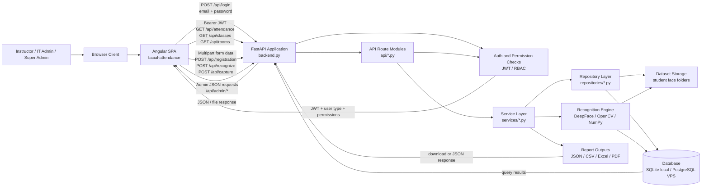

# Chapter 4 System And Deployment Diagrams

This document contains thesis-ready diagrams for the current Facial Recognition Attendance System (FRAS) implementation and the deployed VPS environment. The diagrams are based on the repository implementation, Docker Compose production configuration, Nginx routing, recognition service flow, and the inspected live deployment data.

## API Communication Architecture

The API communication architecture shows how the Angular client communicates with the FastAPI backend through HTTP requests. Authentication begins at the login endpoint, after which the frontend stores the issued JWT and sends it as a bearer token for protected requests. The API layer delegates work to service modules, service modules coordinate business rules, and repository modules access the database and dataset storage.



Figure 1. API communication architecture of FRAS showing the browser client, Angular frontend, FastAPI API layer, authentication checks, service layer, repository layer, database, dataset storage, recognition engine, and report outputs.

## Deployment Topology Diagram

The current VPS deployment is containerized and runs from `/home/frasijbmapua/FRAS` on host `92.205.61.8`. The frontend is served by an Nginx container, the backend is served by a FastAPI/Uvicorn container, and production data is stored in a PostgreSQL container. The dataset folder is mounted from the host into the backend container so registered face images remain available to the recognition pipeline. The PostgreSQL data directory is stored in the `postgres_data` Docker volume.

```mermaid
flowchart TB
    CLIENT[Client Device<br/>Browser with camera access]
    INTERNET[Internet / Local Network]

    subgraph VPS[GoDaddy Linux VPS<br/>Host: 92.205.61.8<br/>App path: /home/frasijbmapua/FRAS]
        subgraph DOCKER[Docker Compose Production Stack]
            FRONTEND[fras-frontend-1<br/>Nginx container<br/>Angular build files<br/>container port 80]
            BACKEND[fras-backend-1<br/>FastAPI + Uvicorn<br/>backend:app<br/>container port 8000]
            DB[fras-db-1<br/>PostgreSQL 16<br/>database: frasdb<br/>container port 5432]
            MIGRATE[migrate tool profile<br/>SQLite to PostgreSQL import]
        end

        HOSTDATA[Host dataset folder<br/>/home/frasijbmapua/FRAS/dataset]
        PGVOL[(Docker volume<br/>postgres_data)]
        ENV[.env configuration<br/>JWT_SECRET, DATABASE_URL,<br/>DATASET_PATH, CORS_ORIGINS]
    end

    CLIENT -->|HTTP to VPS frontend<br/>port 8080 or configured domain proxy| INTERNET
    INTERNET --> FRONTEND

    FRONTEND -->|serves Angular index.html and assets| CLIENT
    FRONTEND -->|proxy /api/*, /docs,<br/>/openapi.json| BACKEND

    BACKEND -->|DATABASE_URL<br/>postgresql://fras_user@db:5432/frasdb| DB
    BACKEND -->|read/write face images<br/>DATASET_PATH=/app/dataset| HOSTDATA
    DB --> PGVOL
    ENV --> FRONTEND
    ENV --> BACKEND
    ENV --> DB
    MIGRATE -->|one-time import from attendance.db| DB
```

Figure 2. Deployment topology of the current FRAS VPS environment showing the client device, GoDaddy VPS host, Docker Compose services, Nginx frontend container, FastAPI backend container, PostgreSQL database container, dataset bind mount, environment configuration, and migration tool profile.

## Recognition Workflow Pipeline

The recognition workflow begins when an instructor selects a class and captures a student image from the attendance monitor. The frontend sends the image and selected `class_id` to `/api/recognize`. The backend extracts an embedding from the submitted image, compares it against stored embeddings for students enrolled in the selected class, validates the schedule and duplicate buffer, computes the attendance status using system settings, and inserts an attendance log when the attempt is valid. If embedding matching does not produce a valid match, the system can fall back to direct DeepFace verification against stored dataset images.

```mermaid
flowchart TD
    START([Start])
    SELECT[Instructor selects active class]
    CAPTURE[Capture student face image<br/>from browser camera]
    POST[POST /api/recognize<br/>multipart: file + class_id]
    API[FastAPI recognition route<br/>api/recognition.py]
    SERVICE[RecognitionService<br/>services/recognition_service.py]
    REPO[RecognitionRepository<br/>repositories/recognition_repo.py]
    TEMP[Save uploaded image<br/>as temporary file]
    SETTINGS[Load system settings<br/>model, threshold, late/absent limits,<br/>attendance buffer]
    EMBED[Extract query embedding<br/>DeepFace model]
    LOAD[Load enrolled student embeddings<br/>for selected class]
    COMPARE[Compare embeddings<br/>cosine similarity]
    MATCH{Best similarity<br/>meets threshold?}
    FALLBACK[Fallback image verification<br/>against dataset face image<br/>optional S3 only if USE_S3 enabled]
    FALLBACK_MATCH{Verified by<br/>DeepFace fallback?}
    SCHEDULE[Load class schedule<br/>day, start time, end time]
    VALID_DAY{Today matches<br/>class day?}
    VALID_TIME{Current Manila time<br/>within class schedule?}
    STATUS[Compute attendance status<br/>Present / Late / Absent]
    DUPLICATE{Existing log today<br/>inside buffer window?}
    INSERT[Insert attendance_logs row<br/>student_id, class_id, timestamp,<br/>status_id, notes]
    REFRESH[Return JSON response<br/>and refresh attendance UI]
    FAIL[Return failed recognition<br/>or validation message]
    CLEANUP[Remove temporary image]
    END([End])

    START --> SELECT --> CAPTURE --> POST --> API --> SERVICE --> REPO
    REPO --> TEMP --> SETTINGS --> EMBED --> LOAD --> COMPARE --> MATCH
    MATCH -- Yes --> SCHEDULE
    MATCH -- No --> FALLBACK --> FALLBACK_MATCH
    FALLBACK_MATCH -- Yes --> SCHEDULE
    FALLBACK_MATCH -- No --> FAIL
    SCHEDULE --> VALID_DAY
    VALID_DAY -- No --> FAIL
    VALID_DAY -- Yes --> VALID_TIME
    VALID_TIME -- No --> FAIL
    VALID_TIME -- Yes --> STATUS --> DUPLICATE
    DUPLICATE -- Yes --> REFRESH
    DUPLICATE -- No --> INSERT --> REFRESH
    FAIL --> CLEANUP
    REFRESH --> CLEANUP
    CLEANUP --> END
```



Figure 3. Recognition workflow pipeline of FRAS showing image capture, API submission, embedding extraction, enrolled-student comparison, fallback verification, schedule validation, duplicate checking, attendance status computation, attendance log insertion, and frontend refresh.

## Diagram Notes

The production deployment currently uses PostgreSQL through Docker Compose, while local development and demo execution can still use SQLite. The live dataset path inspected on the VPS is `/home/frasijbmapua/FRAS/dataset`, and the backend uses `DATASET_PATH=/app/dataset` inside the container. The deployed database stores attendance records, users, classes, enrollments, system settings, support tickets, and face embeddings, while the dataset folder stores the registered face image samples used by the recognition fallback path.
