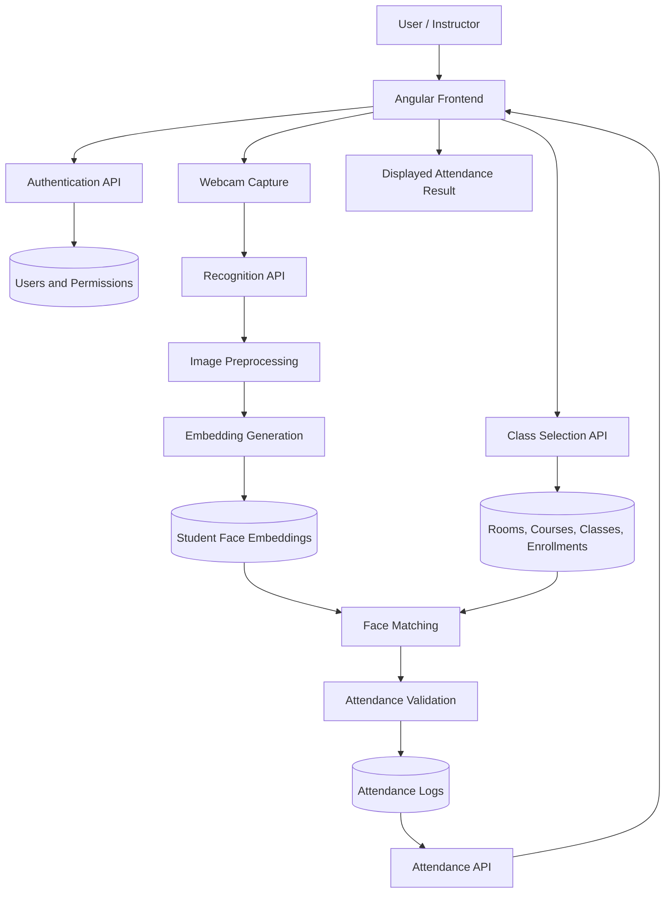
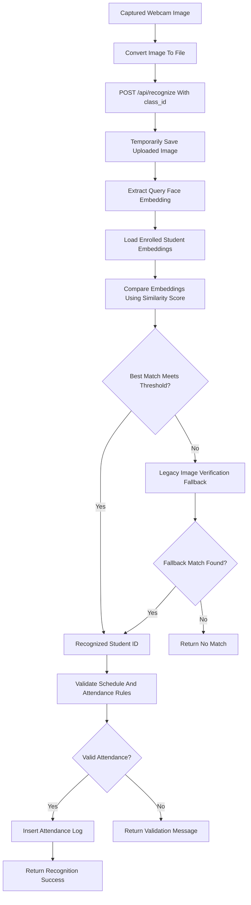
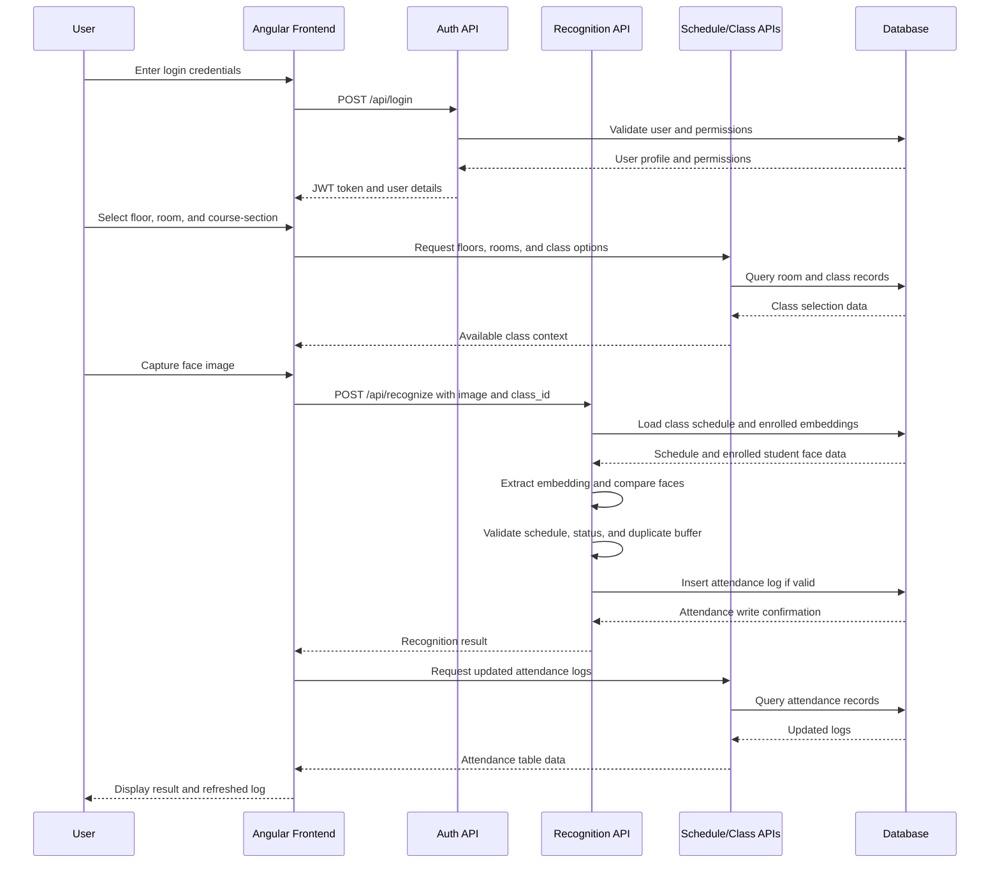

# Conceptual Framework For FRAS

This document describes the conceptual framework of the Facial Recognition Attendance System (FRAS). It explains the major data inputs, image processing flow, face embedding generation, attendance validation pipeline, API interaction flow, and database write operations used by the system.

## 1. Conceptual Overview

FRAS is designed as a web-based attendance monitoring system that connects student enrollment data, class schedule data, webcam image capture, facial recognition, and attendance logging. The system receives student and class information from the database, receives live face images from the frontend camera interface, processes the image through the recognition pipeline, validates the result against class schedule rules, and stores the attendance result in the attendance database.

At a conceptual level, the system follows this process:

1. The user selects the class context, such as floor, room, course, and section.
2. The system captures or receives a student face image.
3. The backend preprocesses the submitted image and extracts a face embedding.
4. The extracted embedding is compared against stored embeddings of enrolled students.
5. If a match is found, the system validates the class schedule, attendance time, and duplicate attendance rules.
6. The system writes a valid attendance record to the database.
7. The frontend refreshes the attendance table and displays the recognition result.

## 2. Data Inputs

FRAS uses several input groups that support the recognition and attendance process.

| Input Type | Source | Purpose |
|---|---|---|
| User credentials | Login form | Authenticates users and determines permissions. |
| Student profile data | Student registration form and database records | Identifies students using student number, name, and email. |
| Face image data | Webcam capture during registration and attendance monitoring | Provides the visual input used for face enrollment and recognition. |
| Course and section data | Database tables for courses, classes, and enrollments | Identifies which students belong to a selected class. |
| Room and schedule data | Room schedule module and database records | Determines the valid room, class day, start time, and end time. |
| System settings | Super admin configuration | Controls recognition threshold, attendance buffer, and attendance classification rules. |
| Authentication token | JWT stored on the frontend | Allows protected API requests to be verified by the backend. |

## 3. Image Preprocessing

Image preprocessing prepares captured face images for recognition. During registration, the student captures multiple face angles, and these images are saved under the dataset folder. During attendance monitoring, the captured webcam frame is converted into an uploaded image file and sent to the recognition endpoint.

The backend temporarily saves the submitted attendance image so that the recognition service can process it. The image is then passed to the face embedding function. Face detection is handled by the recognition library, and the system allows recognition to continue even when strict face enforcement is disabled. This helps the system tolerate normal camera variations while still relying on the embedding comparison and recognition threshold for matching.

The preprocessing concept includes:

| Step | Description |
|---|---|
| Image capture | The browser captures a webcam frame from the student. |
| Image conversion | The frontend converts the captured base64 image into a file or blob. |
| Temporary storage | The backend saves the uploaded file temporarily for processing. |
| Face detection | The recognition engine locates and processes the face region. |
| Normalization | The image is converted into a representation suitable for embedding extraction. |
| Cleanup | Temporary recognition files are removed after processing. |

## 4. Embedding Generation

Face embeddings are numerical representations of student face images. Instead of comparing raw images directly, the system converts a face image into an embedding vector. This allows the backend to compare the captured face against stored student face data more efficiently.

During student registration, the backend saves the submitted face images and generates an embedding from the available student face image. The generated embedding is stored in the `student_face_embeddings` table together with the student ID, model name, embedding value, and source image path.

During attendance recognition, the captured webcam image is also converted into an embedding. The backend loads stored embeddings only for students enrolled in the selected class. It then compares the submitted embedding with enrolled student embeddings using similarity comparison. If the best match reaches the configured recognition threshold, the student is considered recognized.

If embedding-based recognition does not produce a match, the system can use a legacy image-to-image verification fallback against stored student face images. This improves compatibility with existing dataset records.

## 5. Attendance Validation Pipeline

Recognition alone does not automatically create an attendance record. FRAS applies attendance validation rules before writing to the database. These rules ensure that the recognized student belongs to the selected class, that the current Manila date and time match the class schedule, and that the same student is not repeatedly recorded within the configured attendance buffer.

The attendance validation pipeline includes:

| Validation Stage | Purpose |
|---|---|
| Class lookup | Confirms that the selected `class_id` exists. |
| Enrollment filtering | Limits recognition candidates to students enrolled in the selected class. |
| Day validation | Confirms that the class is scheduled on the current Manila day. |
| Time validation | Confirms that recognition occurs within the class start and end time. |
| Status classification | Determines whether the student is Present, Late, or Absent based on configured thresholds. |
| Duplicate prevention | Checks whether the same student already has a recent attendance record for the same class and date. |
| Attendance write | Inserts the attendance log only after the validation checks pass. |

## 6. Database Writes

The database stores both setup data and operational attendance data. Database writes occur during registration, schedule editing, user management, support ticket activity, system configuration, and attendance recognition.

For the recognition and attendance workflow, the most important database writes are:

| Database Write | Table | Description |
|---|---|---|
| Student registration | `students` | Creates or updates student identity and face data path. |
| Class enrollment | `enrollments` | Links the student to selected course-section classes. |
| Face embedding storage | `student_face_embeddings` | Stores generated face embeddings for recognition. |
| Attendance logging | `attendance_logs` | Stores recognized attendance records with timestamp, class ID, student ID, status, and notes. |
| System settings update | `system_settings` | Stores recognition thresholds, attendance buffers, and operational configuration. |
| Support ticket creation | `support_tickets` | Stores user-submitted support requests. |
| Ticket reply creation | `ticket_replies` | Stores replies and internal notes for support tickets. |

The attendance log write is performed only after the system validates the recognition result, class schedule, attendance status, and duplicate attendance buffer. This prevents the database from storing records that are outside the class schedule or repeated too frequently.

## 7. Data Flow Diagram

## 8. Recognition Pipeline Diagram

## 9. API Interaction Flow

## 10. Conceptual Framework Paragraph

The conceptual framework of FRAS is centered on the conversion of student identity, class schedule, and webcam image data into validated attendance records. The frontend collects user credentials, class selection details, and captured face images, then sends these inputs to the backend through protected API endpoints. The backend preprocesses the submitted image, extracts a face embedding, compares it with stored embeddings of students enrolled in the selected class, and identifies the best matching student when the similarity threshold is satisfied. Before writing an attendance record, the system validates the selected class schedule, current Manila day and time, attendance status thresholds, and duplicate attendance buffer. Once these checks pass, the backend writes the attendance result to the database and returns the recognition outcome to the frontend. This framework ensures that attendance is not based only on face recognition, but also on enrollment, schedule validity, time rules, and database integrity.

